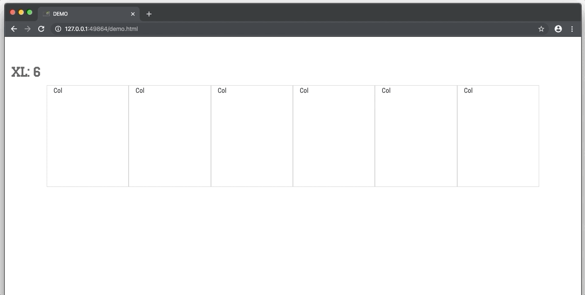

## Bootstrap 4 block grid

Tired of amount of classes you should apply to each column in bootstrap?

```html
<div class="container">
    <div class="row">
        <div class="col-sm-6 col-md-4 col-lg-3 col-lg-2">Col</div>
        <div class="col-sm-6 col-md-4 col-lg-3 col-lg-2">Col</div>
        <div class="col-sm-6 col-md-4 col-lg-3 col-lg-2">Col</div>
        <div class="col-sm-6 col-md-4 col-lg-3 col-lg-2">Col</div>
        <div class="col-sm-6 col-md-4 col-lg-3 col-lg-2">Col</div>
        <div class="col-sm-6 col-md-4 col-lg-3 col-lg-2">Col</div>
    </div>
</div>
```

### Dead simple solution!

Control number of columns by adding class to your **.row**
Define at least number of columns for extra small and small screens, or number for all breakpoint ranges:

```html
<div class="container">
    <div class="row xs-up-1 sm-up-2 md-up-3 lg-up-4 xl-up-6">
        <div class="col">Col</div>
        <div class="col">Col</div>
        <div class="col">Col</div>
        <div class="col">Col</div>
        <div class="col">Col</div>
        <div class="col">Col</div>
    </div>
</div>

<!--or without specifying all the ranges: 1 col for xs, 2 for sm, md, 4 for lg and up-->
<div class="container">
    <div class="row xs-up-1 sm-up-2 lg-up-4">
        <div class="col">Col</div>
        <div class="col">Col</div>
        <div class="col">Col</div>
        <div class="col">Col</div>
        <div class="col">Col</div>
        <div class="col">Col</div>
    </div>
</div>
```
### DEMO


### How to do this?

1. Include ```bootatrap-block.css``` from ```/dist/``` directory of this [repository](https://github.com/sashabeep/bootstrapblockgrid)
2. Add "up-to" classes to your row which defines number of columns on particular breakpoint
3. That's it

### Every number from 1 to 12

5, 7, 11 columns in row? No problem!

### About extra small size

**.col-xs** classes was removed from Bootstrap 4. But you still need to specify amount of columns in a row for the screen width <576px using ```row xs-up-N``` classes to prevent horizontal stacking.

To prevent this behavior when you don't want to use extra small classes replace the xs-section in css file with this code:
```css
@media (max-width: 575.98px) {
	div[class*="-up-"] {
		-webkit-flex-wrap: wrap;
		-moz-flex-wrap: wrap;
		-ms-flex-wrap: wrap;
		flex-wrap: wrap
	}
	div[class*="-up-"] > .col {
		-webkit-box-flex: 0 0 100%;
		-moz-box-flex: 0 0 100%;
		-webkit-flex: 0 0 100%;
		-ms-flex: 0 0 100%;
		flex: 0 0 100%;
		max-width: 100%
	}
}
```
That will made all the columns in row 100% width on the screen <576px. Be careful with class names containing "**-up-**" substring in this case.

### Customizing

By default, css is compiled with default bootstrap breakpoints.

```sass
$breakpoints:
(xs: 576px,
sm: 768px,
md: 992px,
lg: 1200px);
```

Feel free to change source SCSS from ```/src/``` directory of this [repository](https://github.com/sashabeep/bootstrapblockgrid)

Mixins for responsive breakpoints was taken from https://glennmccomb.com/articles/useful-sass-scss-media-query-mixins-for-bootstrap/

### If it helps?

Donate a couple of bucks on [paypal](https://www.paypal.me/sashabeep) if you wanted.
